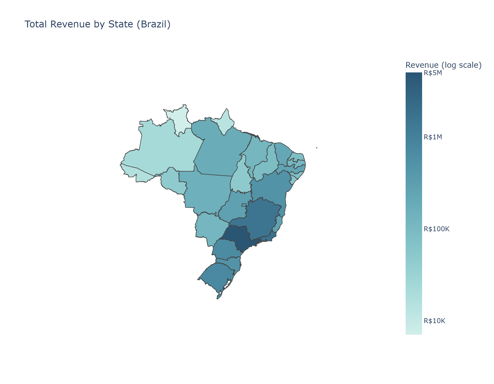

# E-Commerce Sales & Customer Performance Analysis

**An end-to-end data analytics case study on the Olist Brazilian E-Commerce dataset — from raw CSVs to a stakeholder-ready business report.**


---

## Business Context

Acting in the role of a newly onboarded Data Analyst at an e-commerce company, this project answers six core business questions management needs ahead of next-quarter planning — using two years (2016–2018) of real transactional data from the [Olist Brazilian E-Commerce Public Dataset](https://www.kaggle.com/datasets/olistbr/brazilian-ecommerce).

**Business questions answered:**
1. What is the monthly sales trend, and is there a seasonal pattern?
2. Which product categories drive the most revenue, and which are underperforming?
3. Which states contribute the most orders, and how does regional delivery time compare?
4. Is there a correlation between late deliveries and review scores?
5. Which payment methods are most common, and do they correlate with order value?
6. Who are the top 20% customers by revenue (Pareto analysis), and what does the concentration look like?

This is a **descriptive/diagnostic** analysis — it answers *what happened and why*, as opposed to a companion causal-inference project on the same dataset that addresses causal "what if" pricing questions using IV/DiD methods.

---

## Key Findings

| # | Finding |
|---|---|
| 1 | Monthly orders grew ~10x from Jan to Nov 2017, peaking during Brazil's Black Friday season, then stabilized at 6,000–7,000 orders/month through 2018 |
| 2 | Top 5 product categories generate **39.8%** of total revenue; top 10 generate **62.4%** (out of 73 active categories) |
| 3 | São Paulo (SP) accounts for **~42%** of all orders with the fastest delivery (8.7 days); remote states (RR, AP, AM) face delivery times **3x longer** (26–28 days) |
| 4 | Late deliveries are linked to a review score drop from **4.29 → 2.27** (out of 5) — statistically significant (Point-Biserial r = **-0.39**, p < 0.001, n = 96,353) |
| 5 | Credit card is the dominant payment method (~74% of transactions), with higher average transaction value than vouchers |
| 6 | Top 20% of customers generate **56.5%** of total revenue — a moderate concentration, not an extreme 80/20 Pareto pattern |

Full narrative, charts, and business recommendations are in [`reports/business_report.pdf`](reports/business_report.pdf).

---

## Tech Stack

- **Database:** MySQL — relational schema, data cleaning, window functions (`RANK`, `PERCENT_RANK`), CTEs
- **Python:** `pandas` for data wrangling, `seaborn` / `matplotlib` for exploratory charts, `scipy.stats` for hypothesis testing (Point-Biserial correlation), `plotly` for the geographic choropleth map
- **Environment:** Jupyter Notebook, isolated via `venv`

---

## Project Structure

```
ecommerce-sales-performance-analysis/
├── data/
│   ├── raw/                  # Original Kaggle CSVs (not included — see Setup)
│   └── processed/            # Query exports used as Python inputs
├── sql/
│   ├── 01_setup_schema.sql          # Database creation + initial verification
│   ├── 02_fix_datatypes.sql         # TEXT → DATETIME column fixes
│   ├── 03_cleaning.sql              # clean_orders view (delivered orders only)
│   ├── 04_business_questions.sql    # All 6 business questions
│   └── 05_export_for_python.sql     # Export queries for Tahap 4 (Python)
├── notebooks/
│   └── eda_statistical_analysis.ipynb   # EDA, charts, statistical test, geo map
├── reports/
│   └── business_report.pdf / .docx      # Final stakeholder-facing report (6 pages)
├── outputs/
│   ├── monthly_orders_trend.png
│   ├── monthly_revenue_trend.png
│   ├── review_score_by_delay_status.png
│   └── revenue_by_state_map.png
├── load_data_to_mysql.py     # Loads all raw CSVs into MySQL
├── requirements.txt
└── .gitignore
```

---

## How to Run

**1. Get the dataset**
Download the [Olist Brazilian E-Commerce dataset](https://www.kaggle.com/datasets/olistbr/brazilian-ecommerce) from Kaggle and place all CSV files into `data/raw/`.

**2. Set up the environment**
```bash
python -m venv venv
venv\Scripts\activate        # Windows
pip install -r requirements.txt
```

**3. Load data into MySQL**
```bash
# First create the database in MySQL:
#   CREATE DATABASE olist_sales_analysis;
python load_data_to_mysql.py
```

**4. Run the SQL scripts in order**
Open each file in `sql/` in MySQL Workbench and run sequentially: `01` → `02` → `03` → `04` → `05`.

**5. Run the notebook**
```bash
jupyter notebook
```
Open `notebooks/eda_statistical_analysis.ipynb` and run all cells to reproduce the charts, statistical test, and geographic map.

---

## Sample Visualization



*Total revenue by Brazilian state (log color scale). São Paulo and neighboring southeastern states dominate revenue contribution — a pattern that also correlates with faster average delivery times.*

---

## Author

**Muhammad Yusuf Jamil**
Data Analyst Portfolio — [GitHub: GalFoks](https://github.com/GalFoks)

This project is part of a broader portfolio spanning SQL/Python analytics, causal inference, and machine learning case studies on public and synthetic datasets.
